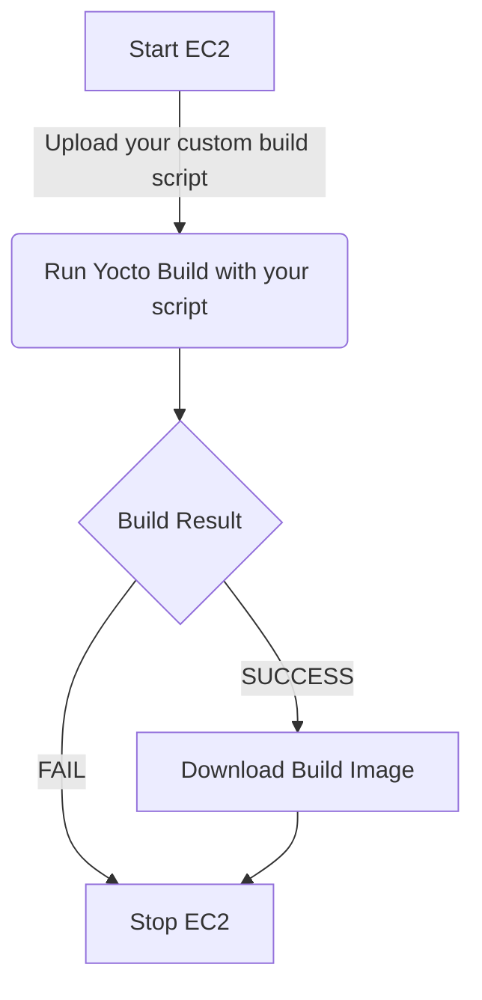

# YOCTO EC2

A project with some tools that may help embedded linux developers build linux image with Yocto on EC2.

The idea we may select a very cool EC2 with 16 cores and 32 GB RAM, this cost us ~$0.4 an hour for a build. We only run the EC2 once we start building the linux image and stop this once we are done. So, the EC2 does not cost us more than $30-$40 a month. it's cheaper than you invest super desktop to build the code, plus utility bill and cooler as well.



### THE CURRENT VERSION IS ONLY SUPPORT NXP iMX SOURCE CODE

## Setup AWS

1. Create EC2 instance:

    - Type: c5.4xlarge and ESB 120GB
    - OS: Ubuntu Server 18.04

    Note: Use ubuntu user for everything.

2. Add your ssh public key to the EC2

    - Copy your public key
        ```bash
        ssh-keygen
        cat ~/.ssh/id_rsa.pub | pbcopy
        ```
    - Paste the key to EC2
        ```bash
        vim .ssh/authorized_keys
        ```

## Clone source code and initialize build environment

Clone your code to your EC2

## Installation

```bash
pip install yoctoEC2
```

#### For current version, I suggest you to initialize build environment and accept EULA by manual.

## Yocto build

You may want to modify build script `build.sh` with your project parameters.

Start EC2, build, copy image and Stop EC2

`yocto-ec2 build --instance-id=<instance-id> --project-root=<project-path> --DISTRO=<distro> --MACHINE=<machine> --IMAGE=<image>`


```bash
yocto-ec2 build --instance-id=i-12345678  --project-root=/home/ubuntu/Workspace/iMX6ULEVK/ --script-path=./build.sh --sdcard-image=/home/ubuntu/Workspace/iMX6ULEVK/build/tmp/deploy/images/imx6ulevk/core-image-base-imx6ulevk.sdcard.bz2
```
